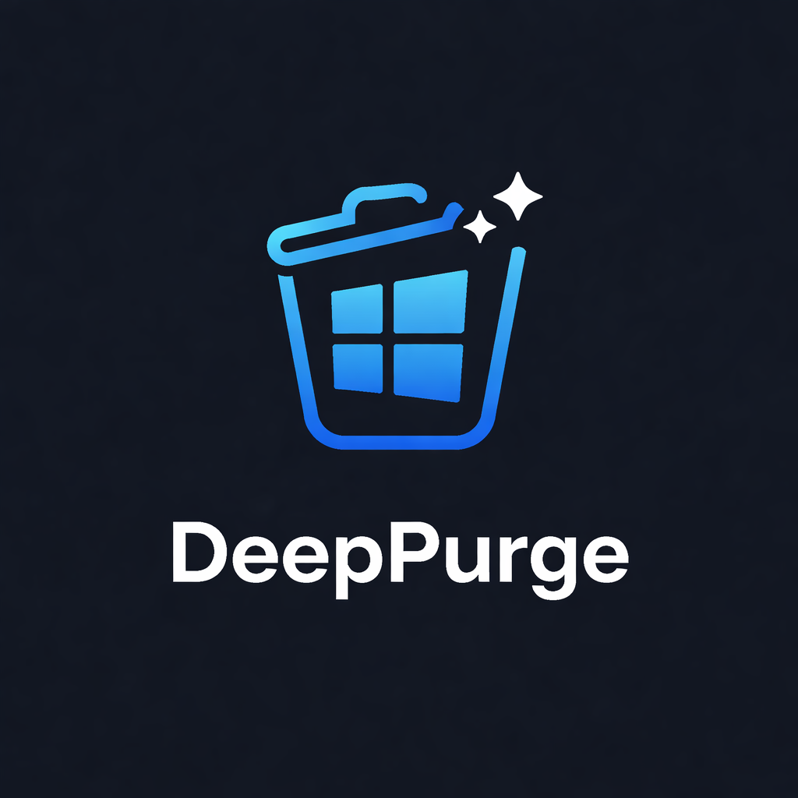

<!-- codex-branding:start -->
<p align="center"></p>

<p align="center">
  
  
  
</p>
<!-- codex-branding:end -->

# DeepPurge v0.9.0

   

A thorough, open-source Windows uninstaller that goes deep. Removes programs completely, hunts down every leftover, and cleans system cruft that other tools miss. Ships a GUI and a headless CLI for scripting / Task Scheduler / Intune / SCCM.

## Features

### Uninstall
- **Installed Programs** - Full registry scan (HKLM + HKCU, 32/64-bit) with extracted program icons
- **Bulk Uninstall** - Multi-select + one-click sequential uninstall with silent flags auto-applied *(inspired by BCUninstaller)*
- **winget integration** - Programs tracked by winget are tagged with their package ID; upgrade-available badge + right-click → "Upgrade via winget" *(inspired by BCU source-adapter pattern)*
- **Scoop integration** - Scoop apps that skip the Windows installer DB are auto-discovered and merged into the list
- **Silent-switch database** - Curated per-installer-family silent flags (`/S`, `/qn`, `/VERYSILENT`, `/quiet`, Squirrel `--uninstall --silent`) with vendor fingerprint overrides *(inspired by PatchMyPC)*
- **Forced Uninstall** - Scan for remnants of already-removed or partially uninstalled programs
- **Windows Apps** - Remove UWP/MSIX apps including system bloatware
- **Leftover Scanner** - Three scan modes (Safe / Moderate / Advanced) for registry keys, files, and folders
- **Export** - Export installed programs list to HTML, CSV, or JSON

### Cleanup
- **Junk Cleaner** - Browser caches, temp files, crash dumps, prefetch, installer cache, Windows Update leftovers
- **Evidence Remover** - Recent documents, jump lists, thumbnail cache, clipboard, DNS cache, Explorer history, Windows logs, crash reports, error reports, font cache, delivery optimization cache
- **Empty Folders** - Scan common locations for empty directory trees and remove them
- **Disk Analyzer** - Folder size breakdown and large file finder (50MB+) with delete capability. Uses WizTree's raw-MFT technique (`FSCTL_ENUM_USN_DATA` + `FSCTL_GET_NTFS_FILE_RECORD`) on NTFS volumes; parallel `FindFirstFileExW(FIND_FIRST_EX_LARGE_FETCH)` fallback on ReFS/FAT32. Typical full-drive scan in seconds.
- **Dry-run / Preview mode** - Every destructive pipeline can be previewed: enumerate and size items without touching them *(inspired by BleachBit)*
- **Secure Delete** - Privacy-grade wipe (single-pass cryptographic random + opaque rename + delete — multi-pass DoD wipes are obsolete on SSDs and deliberately omitted) *(inspired by BleachBit/PrivaZer)*
- **Live progress bars** - Every long-running delete reports item / total / bytes-freed / current path in the status bar

### System Management
- **Autorun Manager** - Registry Run/RunOnce, startup folders, and service autoruns with **reversible** disable (StartupApproved pattern) and delete
- **Startup Impact ratings** - High / Medium / Low per autorun process, parsed from the Windows Diagnostic Infrastructure boot traces in `System32\wdi\LogFiles\StartupInfo\*.xml`. Same metric Task Manager uses — no undocumented APIs.
- **Digital signature badges** - Every autorun entry and service shows its WinVerifyTrust result (signer CN / Unsigned / Untrusted / Revoked) *(inspired by Sysinternals Autoruns)*
- **Browser Extensions** - Scan and remove extensions across Chrome, Edge, Brave, Firefox, Vivaldi, Opera
- **Driver Store cleanup** - Enumerate third-party driver packages via `pnputil /enum-drivers`, group by `.inf` family, flag old versions for removal. Recovers 2-10 GB on OEM laptops. *(inspired by RAPR / DriverStoreExplorer)*
- **Context Menu Cleaner** - Find and remove orphaned shell context menu entries with broken executables or CLSIDs
- **Shortcut repair** - Enumerate `.lnk` files on Desktop / Start Menu via IShellLinkW COM; flag and delete broken-target shortcuts
- **Services Manager** - View all Windows services, identify orphaned services pointing to deleted executables, disable or delete
- **Scheduled Tasks** - Full task inventory with orphan detection, disable and delete capabilities
- **Registry Hunter** - Parallel substring or regex search across HKLM, HKLM\\WOW6432Node, HKCU, and HKCR with scope filters (keys / names / data), live hit counter, and depth / hit / time caps *(inspired by NirSoft RegScanner and Eric Zimmerman's Registry Explorer)*

### Windows Repair
- **SFC / DISM / chkdsk** - One-click `sfc /scannow`, `DISM /RestoreHealth`, `DISM /StartComponentCleanup` (WinSxS), `chkdsk` with live stdout streaming
- **Font + Icon cache rebuild** - Fixes broken cache corruption without a reboot
- **Per-app repair** - `winget repair <id>` and `msiexec /fa {ProductCode} /qn` for reinstall-without-data-loss

### Installation Monitor *(flagship)*
- **Before/after snapshot** - Captures filesystem + registry manifest before and after a traced installer; the diff becomes a precise per-app removal list
- **Replay uninstall** - "Forced Uninstall" now references the exact manifest instead of heuristic name-matching — closed-source Revo's headline feature, open-source
- Manifests persisted in `%LocalAppData%\DeepPurge\Snapshots\<name>.manifest.json` (or `./Data/Snapshots/` in portable mode)

### Community Cleaner Definitions
- **winapp2.ini integration** - Parses the community-maintained [winapp2.ini](https://github.com/MoscaDotTo/Winapp2) database (2,500+ third-party cleaners). Auto-downloads on first run, honours `Detect=` / `DetectFile=` gating so only applicable rules fire. Gated through SafetyGuard on every path.

### Duplicate Finder
- **Three-stage hash** - Group by exact byte-size → XXH3 first-MB head-hash → XXH3 full-file for remaining collisions. Skips reparse points / junctions to avoid infinite loops. *(algorithm from Czkawka / fdupes)*

### Safety
- **System Restore Points** - View, create, and manage restore points
- Automatic restore point creation before uninstall operations (one per batch in bulk mode — Windows throttles SRSetRestorePoint)
- **Registry Backups panel** - Browse, inspect, and restore the `.reg` exports created before every destructive registry op
- Recycle Bin for file deletions (with permanent-delete and secure-delete fallbacks)
- Confidence-based leftover classification (Safe / Moderate / Risky)
- Centralized `SafetyGuard` blocks every destructive call against Windows, Program Files, System32, and protected registry hives

### Automation
- **DeepPurgeCli.exe** - Full headless surface. Every workflow (uninstall, clean, repair, driver/shortcut/duplicate scans, install-trace, winapp2 run, update check) is scriptable. Exit codes follow BCU convention (0/1/2/13/1223).
- **Scheduled cleaning** - Registers tasks in `\DeepPurge\` via `schtasks.exe` running as SYSTEM. "Clean every Monday 03:00" is two clicks.
- **Portable mode** - Drop a file named `DeepPurge.portable` next to the exe; every setting / backup / log redirects to `./Data/` beside the binary. USB-stick / field deployment ready. *(BCU pattern)*
- **Update checker** - Hits GitHub Releases API to flag available upgrades; never blocks startup.

### Themes
Eight built-in themes with runtime switching and persistence between sessions:
- **Catppuccin Mocha** (dark, default)
- **OLED Black** (pure black, blue accent)
- **Dracula** (classic purple)
- **Nord Polar** (frost tones)
- **GitHub Dark** (official palette)
- **Obsidian** (deep black, lavender accent)
- **Matrix** (neon green on black)
- **Arctic** (light mode)

## Build

Requires .NET 8 SDK. Run `BUILD.bat` from the project root.

```
BUILD.bat
```

Output:
- `build\DeepPurge.exe` - GUI, ~66 MB, `requireAdministrator` manifest
- `build\DeepPurgeCli.exe` - CLI, ~66 MB, `asInvoker` manifest (scriptable, elevate externally if needed)

Both are self-contained single-file portable executables.

## CLI quickstart

```bash
DeepPurgeCli list                           # TSV-formatted installed programs
DeepPurgeCli uninstall "Some App" --silent  # Silent uninstall with auto-flag detection
DeepPurgeCli clean junk evidence --dry-run  # Preview what would be freed
DeepPurgeCli repair sfc                     # sfc /scannow
DeepPurgeCli drivers --old                  # Old driver packages ready to remove
DeepPurgeCli startup-impact                 # High/Medium/Low per autorun process
DeepPurgeCli duplicates C:\Users\you        # Duplicate file groups
DeepPurgeCli snapshot trace "MyApp" setup.exe  # Record install delta
DeepPurgeCli winapp2 .\winapp2.ini --dry-run   # Run community cleaner database
DeepPurgeCli schedule add --name Nightly --freq weekly --time 03:00 --day Mon --args "clean junk evidence"
DeepPurgeCli schedule list
DeepPurgeCli schedule remove --name Nightly
DeepPurgeCli check-update
DeepPurgeCli doctor                         # Environment self-test (14 checks)
```

## Testing

```bash
dotnet test tests/DeepPurge.Tests/DeepPurge.Tests.csproj
```

Covers UpdateChecker version-compare, Winapp2Parser detect/bucket routing, StartupImpact thresholds, SafetyGuard block/allow lists, ScheduleManager name sanitisation, and DataPaths path resolution.

## Packaging

- **winget** — `packaging/winget/SysAdminDoc.DeepPurge.yaml` (submit via `wingetcreate`)
- **Scoop**  — `packaging/scoop/deeppurge.json` (drop into a personal bucket)
- **GitHub Releases** — `.github/workflows/release.yml` builds, tests, SHA256s, and attaches both exes on tag push
- **Authenticode signing** — `./Build.ps1 -Sign -CertPath signing.pfx -CertPassword (Read-Host -AsSecureString)`


## Requirements
- Windows 10/11
- Run as Administrator (enforced by the manifest)
- .NET 8 SDK (build only)
- Optional: winget (auto-detected; enrichment silently no-ops when unavailable)
- Optional: Scoop in `%USERPROFILE%\scoop\apps` (filesystem-scanned; no shelling required)

## License
MIT License
