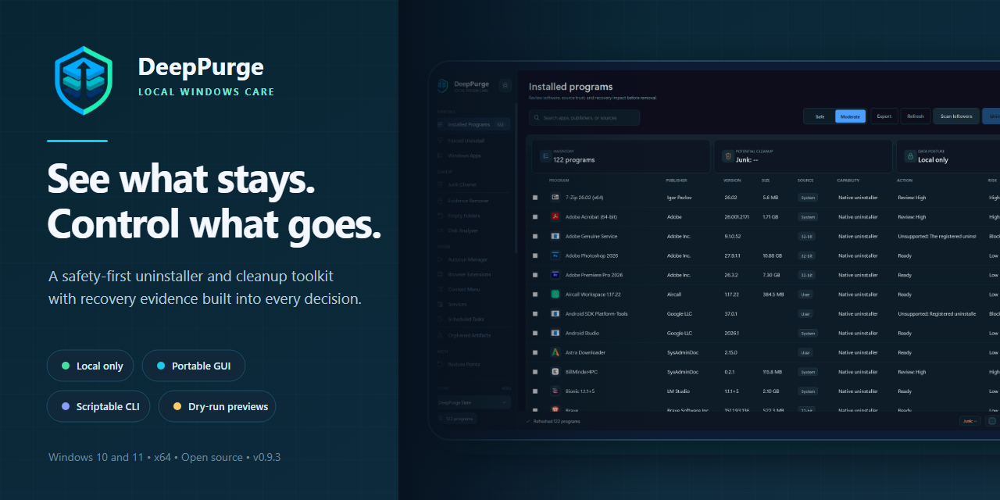
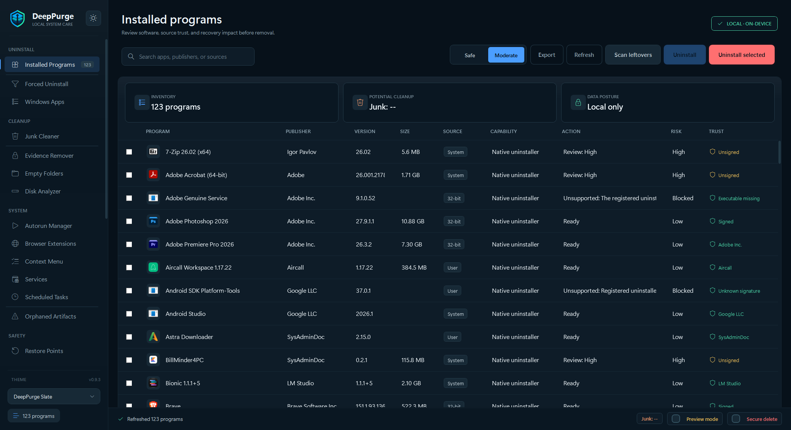
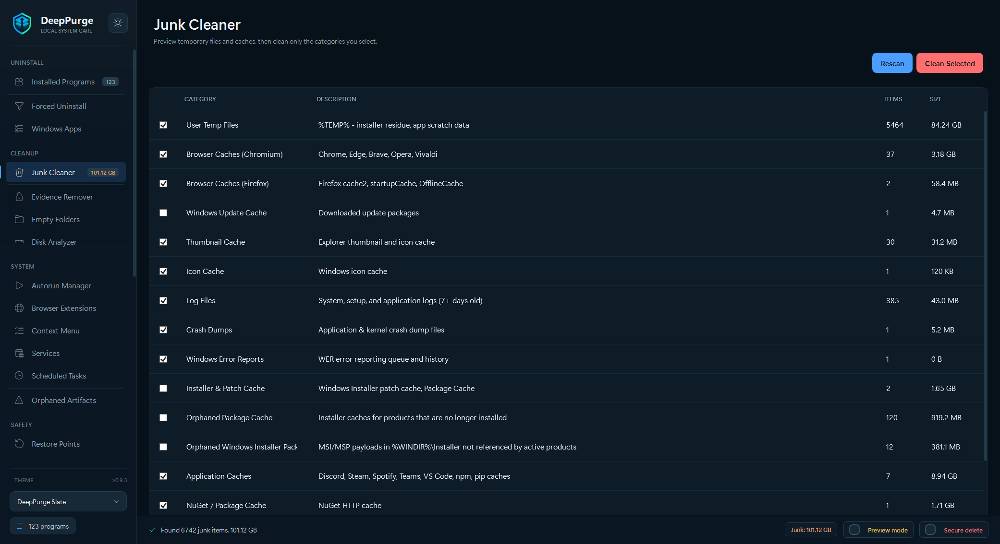
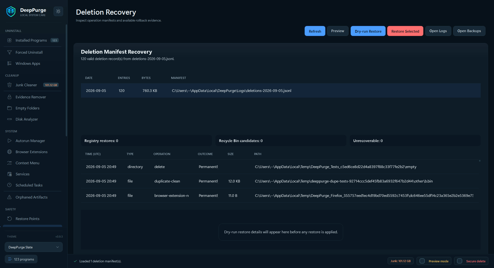

<p align="center">
  
</p>

# DeepPurge v0.9.2

    

**See what stays. Control what goes.**

DeepPurge is a safety-first Windows uninstaller and cleanup toolkit. It inventories software, traces leftovers, scores system hygiene, and records recovery evidence before guarded changes. Everything runs locally.

[Download the portable GUI](https://github.com/SysAdminDoc/DeepPurge/releases/latest/download/DeepPurge.exe) · [Download the CLI](https://github.com/SysAdminDoc/DeepPurge/releases/latest/download/DeepPurgeCli.exe) · [View the latest release](https://github.com/SysAdminDoc/DeepPurge/releases/latest)



## Know what you're removing

DeepPurge brings installed programs, package sources, signatures, removal capability, and risk signals into one review surface. Unsupported actions stay disabled. Native uninstall commands are checked again immediately before execution.



## Cleanup you can inspect first

The Junk Cleaner groups real files by category and size. Preview mode lets you see the result before deletion, while age limits and protected-path checks prevent careless cleanup.



## Recovery evidence stays visible

The Deletion Recovery workspace records what happened, how an item was removed, and which rollback path is still available. Dry-run restore checks show the result before DeepPurge applies anything.



## Why DeepPurge

| | What it changes |
|---|---|
| **Removal you can audit** | See the exact source, command, publisher, signature, and risk before an uninstall starts. |
| **Recovery is designed in** | Ordinary files use the Recycle Bin where supported. Registry and administrative changes carry bounded rollback evidence when recovery is available. |
| **Local by design** | No account, telemetry service, or cloud upload is required. Portable mode can keep settings, logs, and backups beside the executable. |
| **GUI and CLI parity** | Use the WPF app for review or the `asInvoker` CLI for scripts, Task Scheduler, Intune, and SCCM. |

## Safety is the product

- Preview and dry-run routes report intended changes without deleting anything.
- Protected Windows paths, registry roots, services, and Microsoft task namespaces fail closed.
- File identity, hashes, signatures, ownership evidence, and operation records are checked where the workflow supports them.
- Recovery is described honestly. Secure deletion and some system operations can't be undone.

The GUI uses a `requireAdministrator` manifest because it presents system-wide inspection and maintenance in one process. `DeepPurgeCli.exe` uses an `asInvoker` manifest so read-only commands work in a normal shell. Elevate the CLI only for an operation that needs it.

## Download and verify

DeepPurge is portable. Download the two release files you need:

| File | Purpose |
|---|---|
| [`DeepPurge.exe`](https://github.com/SysAdminDoc/DeepPurge/releases/latest/download/DeepPurge.exe) | WPF desktop app. Run as administrator. |
| [`DeepPurgeCli.exe`](https://github.com/SysAdminDoc/DeepPurge/releases/latest/download/DeepPurgeCli.exe) | Scriptable command line. Runs as the current user by default. |
| [`SHA256SUMS.txt`](https://github.com/SysAdminDoc/DeepPurge/releases/latest/download/SHA256SUMS.txt) | Published SHA256 values for both executables. |

Verify a download in PowerShell:

```powershell
Get-FileHash .\DeepPurge.exe -Algorithm SHA256
Get-Content .\SHA256SUMS.txt
```

To keep all state beside the binaries, create an empty `DeepPurge.portable` file in the same folder before launch.

## Start with the CLI

Read-only commands work from a normal terminal:

```powershell
DeepPurgeCli.exe list
DeepPurgeCli.exe health --json
DeepPurgeCli.exe clean junk evidence --dry-run
DeepPurgeCli.exe drivers --old
DeepPurgeCli.exe startup-impact
DeepPurgeCli.exe orphans --remnants
DeepPurgeCli.exe doctor
DeepPurgeCli.exe check-update
```

Guarded mutation examples:

```powershell
DeepPurgeCli.exe uninstall "Some App" --dry-run
DeepPurgeCli.exe duplicates C:\Users\you --delete --reference-folder C:\Users\you\Documents\Keep --dry-run
DeepPurgeCli.exe drivers --remove oem42.inf --dry-run
DeepPurgeCli.exe slim --dry-run
```

Run `DeepPurgeCli.exe help` for the full command surface and exit-code contract.

## What it covers

The interface is organized around the work you are trying to do:

| Workspace | Highlights |
|---|---|
| Software | Installed programs, Bulk Uninstall, Forced Uninstall, Windows Apps, Leftover Scanner, package sources, trust facts, and Export. |
| Cleanup | Junk Cleaner, Evidence Remover, Empty Folders, Disk Analyzer, MSI/MSP orphan cleanup, and Skipped-item details. |
| System | Autorun Manager, Browser Extensions, Services Manager, Scheduled Tasks, Context Menu Cleaner, and Registry Hunter. |
| Diagnostics | Health Dashboard, Startup Impact ratings, Digital signature badges, BAM remnant discovery, and OEM bloat scoring. |
| Repair | SFC / DISM / chkdsk, Font + Icon cache rebuild, Per-app repair, and Driver Store cleanup. |
| Advanced | Installation Monitor, System Slimming, Duplicate Finder, winapp2.ini integration, and Validated custom JSON cleaners. |

<details>
<summary><strong>Complete capability map</strong></summary>

### Removal and discovery

- **Installed Programs** scans machine and user uninstall records, including 32-bit and 64-bit entries.
- **Bulk Uninstall** applies reviewed native or package-manager routes in sequence.
- **winget integration** enriches installed rows and uses exact package identifiers. Scoop and Chocolatey sources are supported too.
- **Explicit removal capability and trust** distinguishes native uninstallers, package managers, portable folders, game launchers, and unsupported actions.
- **Recoverable portable removal** moves eligible portable folders through the guarded Recycle Bin path.
- **Forced Uninstall** finds remnants after a broken or incomplete removal.
- **Windows Apps** covers AppX and MSIX packages.
- **Leftover Scanner** offers Safe, Moderate, and Advanced evidence modes.
- **Portable app detection**, **Game platform detection**, **Game removal safety**, **Bundleware / sideload detection**, and **OEM bloat scoring** add context that the uninstall registry misses.

### Cleanup and system care

- **Junk Cleaner**, **Evidence Remover**, **Empty Folders**, and **Disk Analyzer** cover common storage and privacy work.
- **MSI/MSP orphan cleanup** checks installer payloads against registered products.
- **Dry-run / Preview mode** is available across destructive pipelines.
- **Secure Delete** is an expert-only selected-file path. It doesn't claim to wipe volume free space.
- **Skipped-item details** explain missing, denied, protected, locked, failed, and too-recent results.
- **Autorun Manager**, **Startup Impact ratings**, **Digital signature badges**, and **Browser Extensions** surface startup and browser risk.
- **Driver Store cleanup** exports and hashes a rollback package before supported removal.
- **Context Menu Cleaner**, **Shortcut repair**, **Services Manager**, and **Scheduled Tasks** find broken or orphaned system entries.
- **Registry Hunter** uses explicit key, name, value, depth, hit, and time limits.
- **BAM remnant discovery** finds evidence of executables that are no longer installed.

### Repair, monitoring, and definitions

- **SFC / DISM / chkdsk**, **Font + Icon cache rebuild**, and **Per-app repair** expose Windows repair routes with live output.
- **Before/after snapshot** records filesystem and registry state around an installer.
- **Replay uninstall** accepts only authoritative manifests and revalidates file identity before removal.
- **Diagnostic journal evidence** adds USN and optional Sysmon context for review. It is not treated as deletion authority.
- **winapp2.ini integration** records source, commit, hash, expanded targets, and a last-known-good copy.
- **Validated custom JSON cleaners** are schema checked and unsafe definitions are quarantined.
- **Three-stage hash** groups duplicate candidates by size, head hash, and full hash.
- **Explicit keeper and identity revalidation** protects the chosen copy and aborts changed duplicate groups.

### Operations and recovery

- **Health Dashboard** reports category scores, source diagnostics, and trends.
- **System Slimming** remains scan-only until an expert explicitly selects guarded removal.
- **Context menu** registration adds an optional `Uninstall with DeepPurge` shell action.
- **Expert / Safe mode** gates advanced operations and secure deletion.
- **Versioned settings import/export** moves exclusions, retention, cookie preservation, notes, and safety defaults with validation and backups.
- **System Restore Points**, **Deletion Recovery panel**, and **Registry Backups panel** show the recovery evidence available for each operation.
- **Scheduled cleaning** uses constrained Task Scheduler actions and a protected CLI copy.
- **Portable mode** redirects settings, logs, backups, and snapshots into `./Data/`.
- **Update checker** reads GitHub Releases without installing anything.
- **Tray icon** keeps schedule status and a background dry-run preview close at hand.

</details>

## Build and test

The repo pins the exact .NET SDK `10.0.302` in `global.json`. Roll-forward is disabled and package lockfiles are committed.

```powershell
./Build.ps1
```

Release builds run all 459 tests, locked restore, and the project-level NuGet dependency audit before publishing self-contained x64 executables to `build\`. They also create `build\SHA256SUMS.txt`.

Useful release checks:

```powershell
./Build.ps1 -AuditDependenciesOnly
./Build.ps1 -Sign
./Build.ps1 -ValidateReleaseOnly -ReleaseChecksumsPath build\SHA256SUMS.txt
```

`Build.ps1 -Sign` uses an Authenticode certificate supplied by path, environment variable, or Current User certificate-store thumbprint. Unsigned local builds are allowed, but Windows SmartScreen may warn when they are shared.

The screenshot tool builds the real production WPF window and runs it on a private Windows desktop:

```powershell
dotnet build tools\DeepPurge.Capture\DeepPurge.Capture.csproj -c Release -r win-x64
.\tools\DeepPurge.Capture\bin\Release\net10.0-windows10.0.17763.0\win-x64\DeepPurge.Capture.exe
```

## Project notes

- [Architecture](ARCHITECTURE.md)
- [Contributing](CONTRIBUTING.md)
- [Security policy](SECURITY.md)
- [Changelog](CHANGELOG.md)

DeepPurge is released under the [MIT License](LICENSE).
